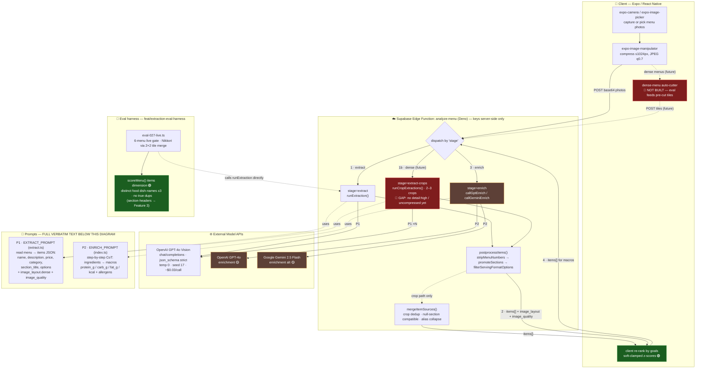

# Menu Extraction Pipeline — Current Status

> **Canonical file** (roadmap links here; keep it updated as Features 2–5 close).
> A snapshot copy also lives at `~/Downloads/menu-extraction-pipeline.md`.
>
> **Last updated:** 2026-07-06 — Feature 1 (food-item extraction) CLOSED.
> **Legend:** 🟢 done · 🟡 built but not gated/benched · 🔴 not built yet.



## Call order (happy path)

1. **Client** captures → compresses (≤1024px, q0.7) → `POST analyze-menu {stage:"extract"}`.
   *Dense menus (future):* client cuts tiles → `stage:"extract-crops"`.
2. **Edge `runExtraction`** → OpenAI GPT-4o Vision with **P1** (`EXTRACT_PROMPT` + strict `EXTRACT_SCHEMA`, temp 0, seed 17) → parse → `postprocessItems()` → returns `items[]` + `image_layout` + `image_quality`.
   *Crop path:* N parallel calls → `mergeItemSources()` dedups across tiles.
3. **Client** sends the items back → `POST {stage:"enrich"}` → `callGptEnrich` (GPT-4o) **or** `callGeminiEnrich` (Gemini 2.5 Flash) with **P2** (`ENRICH_PROMPT`) → returns per-item `protein_g / carb_g / fat_g / estimated_calories / allergens`.
4. **Client** re-ranks items by the user's goals (soft-clamped z-scores — already in `main`). Re-ranking reuses saved `parsed_items`; no re-scan.

## Status by stage

| Stage | State | Note |
|---|---|---|
| Food-item extraction (Feature 1) | 🟢 CLOSED | completeness gate: distinct dish-names ±3, no true dups |
| Options / sections / categories / drinks (Features 2–5) | 🟡 | schema already captures the fields; per-dimension quality gates not yet closed |
| Stage 2 enrichment (macros + allergens) | 🟡 | `enrich` stage wired (GPT-4o + Gemini paths); model benchmark not finalized (AGENTS.md) |
| Dense-menu auto-cutter | 🔴 | eval feeds pre-cut Nikkori tiles; production needs an image lib + `extract-crops` extended to 4 high-detail uncompressed crops, keyed on `image_layout.dense` |
| Goal re-ranking | 🟢 | soft-clamped z-scores merged to `main` |

---

## 📝 Prompt Appendix — full verbatim text (its own box)

### P1 · `EXTRACT_PROMPT` — `supabase/functions/analyze-menu/extract.ts`

```text
Read this restaurant menu. Return every item exactly as printed, in menu order:
name, description, price, category, section_title, and options.
Do NOT estimate calories or nutrition. Do NOT invent items you cannot read.
Extract all visible menu items from every provided photo and every menu section.
Do not stop after a representative sample, a section summary, or the first page.
There is no maximum number of items; keep going until every readable item is returned.
Never return a section header as an item.
Copy the nearest printed heading that visually groups an item into section_title.
When a heading contains smaller subheadings, each item belongs to its nearest
subheading, never the parent (a spirits list under a parent heading with per-spirit
subheadings uses the spirit subheading). Use only printed headings; never invent
a grouping that is not printed on the menu. Set section_title to null
only when no heading groups the item. Preserve the item name exactly; never prepend
or synthesize the heading into the name.
A heading is often larger text without its own price, weight, or description, but
it must also group menu items beneath it. Do not treat restaurant names, slogans,
or promotional text as section headings.
Use category "food" for appetizers, entrees, main dishes, and other prepared food.
Use "side", "dessert", or "drink" only when that role is clear; otherwise use "other".
An option is a printed choice about one item's composition: a protein or filling
choice, a paid add-on, a dietary swap, or a flavor choice. Capture each option with
its printed price and weight in grams when present; otherwise use null.
Serving formats and sizes (glass vs bottle, copa vs botella, small vs large) are
NOT options. Distinct products listed under a shared heading are separate items,
not options.
When the same base dish is printed several times with different fillings, proteins,
or preparations, return ONE item named after the base dish and put each printed
variant in options. Never return duplicate item names for variants of one dish.
A choice printed inside a description ("con X o Y", "choice of X or Y") is an
options list; capture each choice in options. Do not move options into the description.
If a description is not printed, use an empty string. If a price is not printed, set it to null.
Assess the visible menu layout. Set image_layout.dense=true only when small text,
many tightly packed items, or a crowded multi-group layout risks incomplete
extraction from the full image. For side-by-side content use crop_direction
"left_right"; for vertically stacked content use "top_bottom". For a normal
menu set dense=false and crop_direction="none".
Assess image quality across all photos. Report blur, low_light, glare, or another concise issue.
Set usable to false only when the menu cannot be read reliably.
```

Response is `json_schema` **strict** (`EXTRACT_SCHEMA`): `image_quality {usable, issues[]}`, `image_layout {dense, crop_direction}`, `items[] {name, description, price, category(food|side|dessert|drink|other), section_title, options[] {name, price, grams}}`. `temperature: 0`, `seed: 17`.

### P2 · `ENRICH_PROMPT` — `supabase/functions/analyze-menu/index.ts`

```text
You estimate the nutrition profile of restaurant menu items. For each item, work step by step:
1. List the most likely ingredients. If the description names them, use them; otherwise infer from the name and category. Tag each ingredient: protein | carb | fat | veg | other.
2. From those ingredients and the likely preparation (e.g. grilled vs fried), estimate per typical single restaurant serving: protein_g, carb_g, fat_g, estimated_calories. If the item's name or description contains explicit weight or portion info — e.g. (280gr), chicken (80gr), 2 chicken breasts sliced — use it as the primary basis for gram estimates rather than a typical portion; prefer printed weights over guesses.
3. Set "confidence" to "low" only when the name and description are evocative or promotional rather than descriptive, leaving you with little ingredient information to go on.
List "allergens" you can infer from the ingredients (e.g. dairy, nuts, gluten, shellfish, egg, soy). Use an empty allergens array when none are inferred; do not include "none". Preserve each item's name, description, price, and category exactly as given. Do NOT sort the items. Return one object per input item, in the same order.
```

Enrichment runs via GPT-4o (`callGptEnrich`) or Gemini 2.5 Flash (`callGeminiEnrich`); output adds `protein_g / carb_g / fat_g / estimated_calories / confidence / allergens[]` per item, order preserved.

---

## How to keep this file current

As each feature closes, update the mermaid `class` status colors + the Status table, and note any prompt/schema change here (P1/P2 are the source of truth other LLMs read). This file is linked from `docs/superpowers/plans/2026-07-04-ocr-extraction-master-roadmap.md`.
